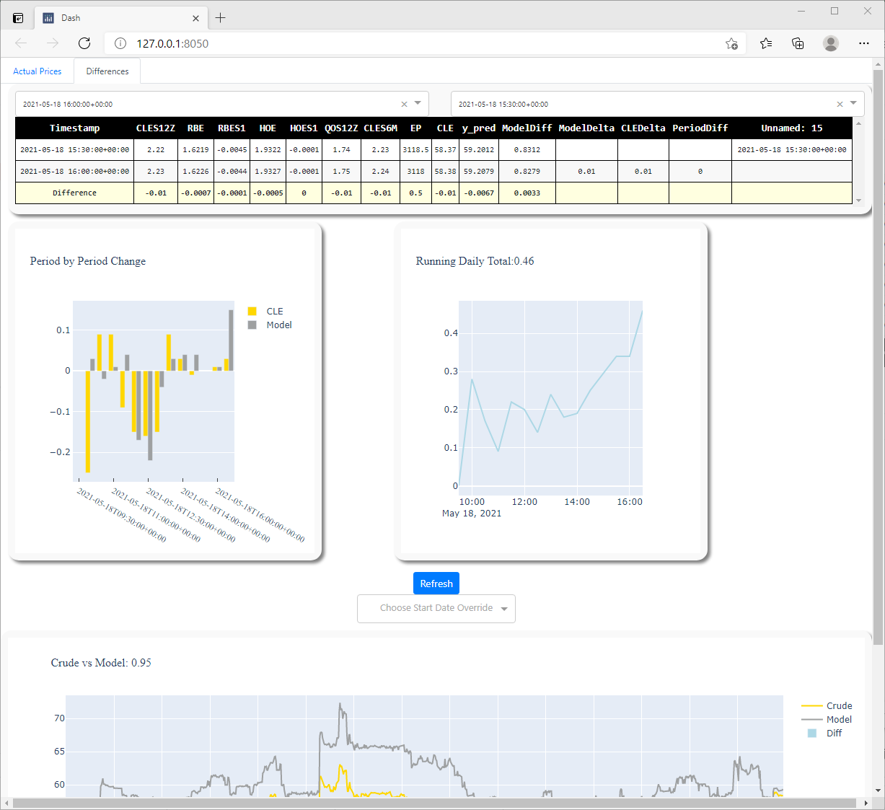

## General info
This project is designed to put a machine learning model into production. The code will query trading platform API for
model inputs, process that data and feed it into the model (example used here is xgBoost) for live predictions. It will then
append predictions to a running file containing prior interval predictions. 

Finally, each time that file is amended with a new prediction, the project has a Dash application, which will automatically pick up latest
data and update the interactive dashboard. Dashboard has the ability to track historical actual vs predictions
on both long term and short term time intervals as well as calculate
differences between periods to better assist with understanding model drivers.

## Screenshots

<b>Main Tab View:</b>

  


<b>Differences Tab View:</b>


	
## Setup
To run this project, install it locally using npm:

```
$ cd ../lorem
$ npm install
$ npm start
```